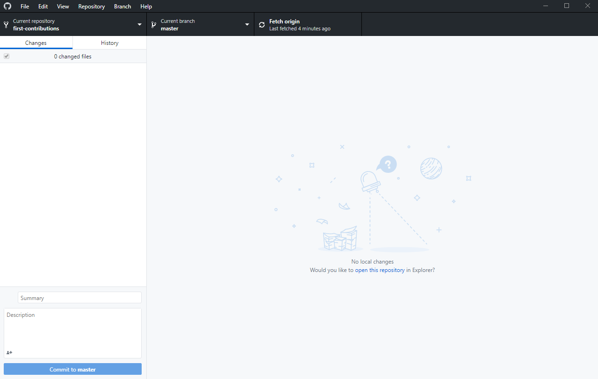
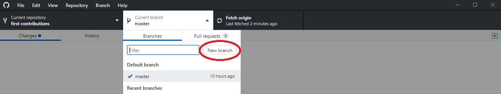
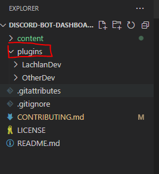
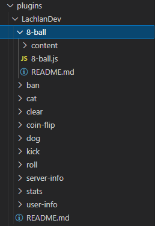
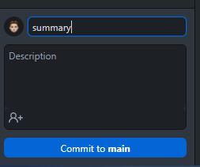

# Contributor's Guide
Please ensure you have GitHub Desktop installed and have logged into your GitHub account! 

The following steps explain how to add a __plugin__ to the repo but themes follow the same structure!

## Fork this repository
Fork this repo by clicking on the fork button on the top right of this page. This will create of copy of this repository in your account.


## Clone the repository
Now clone this repo to your machine.

IMPORTANT: DO NOT CLONE THE ORIGINAL REPO. Go to your fork and clone it.

To clone the repo, click on "Clone or Download" and then click on "Open in Desktop".


A pop up window will open. Click on "Open GitHubDesktop.exe".


After you click on "Open GitHubDesktop.exe" the contents will be downloaded to your computer.



## Create a branch
Now create a branch by clicking on the "Current branch" icon at the top and then click on "New branch":



Name your branch. For example, "LachlanDev"

Click on ``Create branch``

## Make necessary changes and commit those changes
Click on the `Repository` icon at the top and then click on "Open in Visual Studio Code"

Once opened you want to expand the "Plugins" Folder and create a new folder with your name example, "LachlanDev"



Inside the newly created folder you must follow this structure, if ignored your pull request will be ignored. Also check out my folder as an <a href="https://github.com/LachlanDev/Discord-BOT-Dashboard-Marketplace/tree/main/plugins/LachlanDev">example</a>.

```bash
│   LachlanDev - Name of folder (Developer)
│   ├── README.md - Your README file, used to induce yourself or list your plugins
│   └── PluginFolder - Each plugin will be in a seperate folder
│       ├── README.md - Plugin README with documentation etc..
│       └── Plugin Source Code
```

Once completed it should look something like this, if you have further questions or need help feel free to ask me! 

Please ensure you mention packages your plugin requires in the plugins README.md



Head back to GitHub Desktop and click on the "Commit" button in bottom left, you will need to input a summary.



Finally Click the ``Publish`` button on the top right.

## Submit your changes for review
If you go to your repository on github, you'll see ``Compare & pull request button``. click on that button.

You will be redirected to a new page, add a title and leave a comment explaing the commands you have added.

Soon I'll be merging all your changes into the master branch of this project. You will get a notification email once the changes have been merged.

## What's next?
Congrats! You just completed the standard fork -> clone -> edit -> PR workflow that you'll encounter often as a contributor!

You **must** follow the folder structure or your pull request will not be accepted, need assistance join the <a href="https://discord.com/invite/w7B5nKB">Discord Server</a> or message me on Discord LachlanDev#8014


